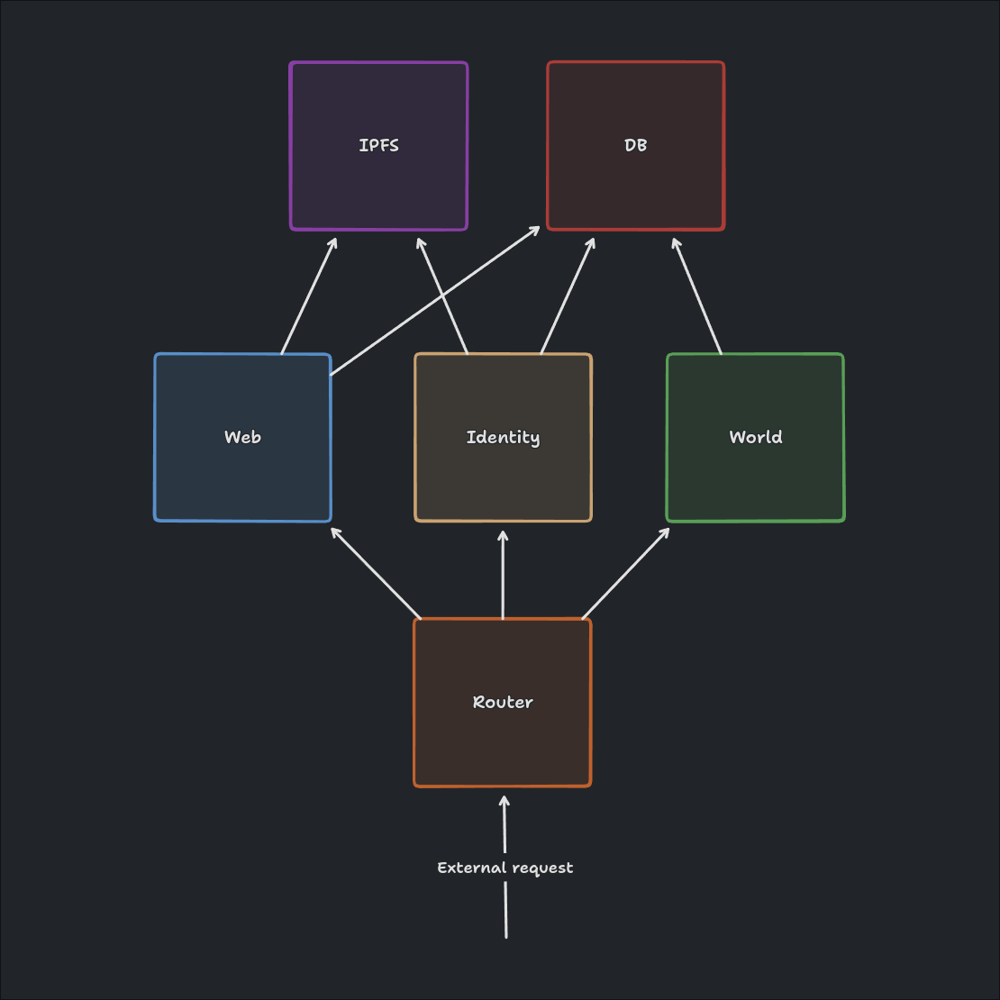

# Server

A modular UNAVI server.

## Architecture

Home server functionality is divided into separate features.
Each feature can be enabled or disabled, allowing for flexibility in deployment.
Note that some features rely on other features.

For example, I may want to run a lightweight home server that only handles user identity,
and disable the other features.
Or I may want to split up my service and run each feature on a separate machine.

  

## Features

### DB

MySQL database.

### IPFS

IPFS Kubo node, used for file storage and retrieval.

### Identity

Allows users to use the server as their home server.
Handles user authentication, and federates social interactions with other servers.

### Web

Hosts a web client.

### World

Allows worlds to use the server as their world server.
Handles networking, connecting player's within a world together.
